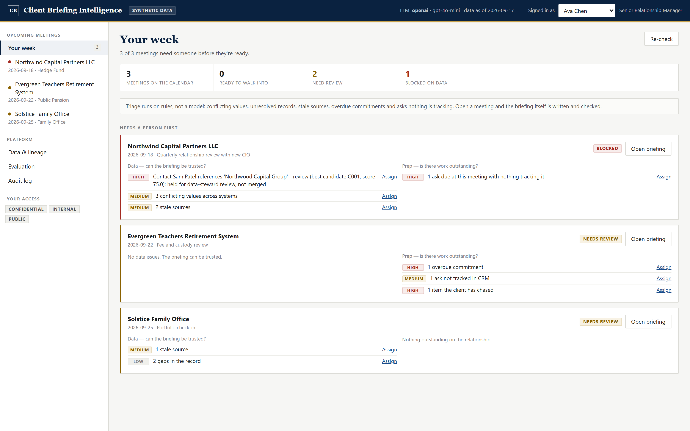
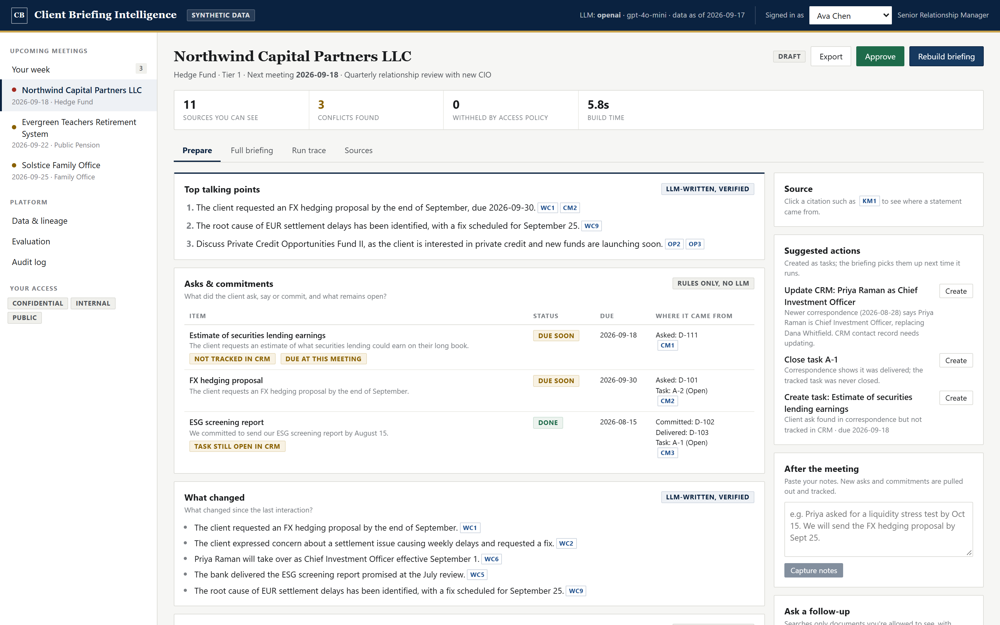

# Client Briefing Intelligence

**A coverage team doesn't have a meeting. It has a calendar.**

So this doesn't open on a document, and it doesn't open on a chat box. It opens on the
week ahead, and answers the question that actually comes first: *which of these meetings
can I walk into, and which need a person before they're ready?*



> Everything here is **fictional and synthetic** — the companies, people, numbers and
> events are all generated. There is no real client or firm data anywhere in this repo.

The brief asked to reimagine the end-to-end workflow and explicitly said *not* to assume
the answer is a memo or a chatbot. A memo is stale the moment it's written; a chatbot
makes the human do the work of knowing what to ask. This is neither. It is a loop:

| | | |
|---|---|---|
| **1 · Triage** | Every upcoming meeting is scored **Ready / Needs review / Blocked** from conflicting values, unresolved records, stale sources and untracked asks. | Rules only — no model, ~250 ms |
| **2 · Hand off** | Data problems route to a steward, relationship problems to the coverage team — and you can only assign to someone already entitled to that client. | Assignment is a workflow action, never a grant |
| **3 · Prepare** | The briefing answers seven questions, every statement cited and machine-checked against its source. | Shape and thresholds set by a YAML *pack* |
| **4 · Capture** | Notes after the meeting become tracked asks and commitments, and feed tomorrow's triage. | The loop closes |

### The one design rule

> **The LLM reads and writes. Code decides.**

Entity resolution, entitlements, every number, conflict detection, commitment status and
the uncertainty section are plain code — because they must be exact, repeatable and
explainable. The model does the two things it is genuinely better at: reading messy free
text, and turning verified facts into readable prose. Even there it is fenced: it sees an
evidence pack and nothing else, it must cite, and a verifier checks every citation and
every number before anything reaches the screen. Fail twice and the section falls back to
deterministic bullets.

### Three things worth clicking

- **`backend/app/briefing/readiness.py`** — triage, and why data and prep are deliberately
  kept as separate axes rather than one blended score.
- **`backend/app/briefing/packs.yaml`** — the briefing shape as configuration. A pack sets
  emphasis, *never* coverage: loading fails if it omits one of the seven questions, and a
  test pins that.
- **`evals/run_evals.py`** — thirteen gates, run in CI on every push. When a gate failed I
  fixed the prompt, never the threshold.

### What the evaluation caught

The offline suite was 13/13 green. The first run against the live model found five real
defects — including one *in the evaluation itself*: the scorecard reported zero verifier
rejections while the executive summary was failing verification on every single build and
silently falling back. The metric summed rejections across sections, and the summary wasn't
in the denominator. Both are fixed; the zero is now honest.

An uninstrumented surface always looks perfect.

## The problem

Before a client meeting, analysts search CRM, finance and product data, service tickets, emails, meeting notes, past briefings, research and approved news by hand. The data is messy: aliases, duplicates, stale and conflicting statements, missing IDs, and restricted records. The team needs a short briefing that answers seven questions:

| # | Question | Section |
|---|---|---|
| 1 | Who is the client and what matters in the relationship? | Client snapshot |
| 2 | What changed since the last interaction? | What changed |
| 3 | What did the client ask, say or commit, and what remains open? | Asks & commitments |
| 4 | Which metrics or performance are material? | Material metrics |
| 5 | Which opportunities should we discuss, and what evidence supports them? | Opportunities |
| 6 | Which news or events should shape the conversation? | News & events |
| 7 | What is uncertain, conflicting or unavailable? | Uncertain / conflicting / unavailable |

## What it does



- **Brings the data together.** A seeded synthetic data pack (12 structured sources and 18 documents) is ingested into one store with lineage, freshness and data-quality checks. Records are matched to clients in order: ID → LEI → alias → fuzzy match, with a review band. Near-misses such as *"Northwood Capital Group"* are held for review, never auto-merged.
- **Controls access.** Identity is carried into every tool call. Checks happen at the row level (coverage), the field level (revenue is confidential) and the document level (classification × purpose). Material non-public information (MNPI) is never usable for a sales briefing and leaves **zero footprint**: it isn't even counted.
- **Uses deterministic analysis where accuracy matters.** Metrics and materiality, conflict detection (AUM across systems, a stale CIO record, a CRM task that was actually completed), commitment status (Open / Due soon / Overdue / Done, plus flags such as *Not tracked in CRM*) and change detection are all plain code. Dates work the same way: an open ask with no stated deadline is due at the next meeting **from the calendar**, because relative references in an email ("by Thursday") are exactly what a model resolves unreliably — in this data set one of them disagrees with the booked date.
- **Uses the LLM only where it adds value.** It extracts asks and commitments from free text, and phrases four narrative sections plus the talking points. Every generated bullet must cite evidence IDs and pass a **checker** (citations exist, numbers match their source, no restricted or injected content). If a bullet fails, the model retries once with feedback. If it still fails, the section falls back to deterministic bullets.
- **Leads with the meeting, not the document.** The briefing opens on **Prepare**: the
  three talking points, what is open and due, what changed, and what is uncertain. The
  full seven-section briefing is one tab away. All seven questions are always answered;
  they are not all equally urgent eighteen hours before a meeting.
- **Drives the workflow.** Suggested actions become tasks with one click. The RM can approve and export the briefing (markdown with numbered sources). **Post-meeting capture** turns notes into tracked asks and commitments, so the next briefing starts where this meeting ended. A follow-up question box searches entitled documents and cites sources.
- **Is observable.** A run trace shows each LangGraph step, every access-checked tool call, and LLM calls, tokens and latency. An audit log records builds, denials, approvals, exports, tasks and notes.
- **Is evaluated.** A 13-metric scorecard runs as a **CI gate**: zero leakage, blocked access, citation validity, number accuracy, coverage of all 7 questions, conflict recall, ledger accuracy, entity-resolution accuracy, retrieval hit rate, extraction F1 against human labels, and prompt-injection resistance.
- **Uses one tool contract everywhere.** The same entitlement-aware tools back the pipeline, the REST API and an **MCP server**.

## Architecture

```mermaid
flowchart LR
  subgraph Sources["Synthetic sources"]
    CRM[CRM accounts, contacts, tasks, pipeline]
    FIN[Finance DW revenue]
    PRD[Product DW holdings]
    PERF[Performance system]
    SVC[Service desk]
    DOCS[Emails, notes, prior briefings, research, approved news]
  end
  subgraph Ingest["Ingestion (python -m app.ingest.pipeline)"]
    ER[Entity resolution: ID, LEI, alias, fuzzy with review band]
    DQ[Data-quality rules: stale, duplicate, missing, unresolved]
    EX[LLM extraction: asks, commitments, changes. Schema-validated, cached, restricted docs never sent]
    LIN[Lineage and freshness]
  end
  STORE[(Canonical store: SQLite stand-in)]
  subgraph Serve["Briefing service"]
    ID[Principal: identity x purpose]
    TOOLS[Typed, entitlement-aware tools: SQL tools and hybrid retrieval BM25+embeddings]
    G[LangGraph: authorize, prepare, plan, 7 sections in parallel, summarize, assemble]
    V[Verifier: citations, numbers, forbidden content]
  end
  UI[React UI: briefing, sources, trace, actions, notes, ask]
  MCP[MCP server]
  EVAL[Eval harness and CI gate]
  Sources --> Ingest --> STORE --> TOOLS
  ID --> TOOLS --> G --> V --> UI
  TOOLS --> MCP
  G --> EVAL
```



### Where the LLM is used, and where it isn't

| Step | LLM? | Why |
|---|---|---|
| Entity resolution, dedupe | **No**: rules + fuzzy score with a review band | Must be explainable and repeatable. A wrong merge is a data-access incident. |
| Entitlements, information barrier | **No** | Security decisions are never probabilistic. Enforced before retrieval or prompting. |
| Metrics, materiality, AUM choice | **No**: SQL + thresholds | Numbers must be exact and auditable. |
| Conflict detection, commitment status | **No** | Deterministic comparison of sources and dates. |
| Extracting asks/commitments/changes from text | **Yes** (JSON schema, validated, cached, scored against golden labels) | Free text is where LLMs add real value. |
| Writing snapshot, changes, opportunities, news, talking points | **Yes**, constrained to the evidence pack and verified | Turns facts into a readable briefing. |
| Uncertainty section, withheld notices | **No** | Must never be "smoothed over". |

## Run it locally (Windows PowerShell)

Prerequisites: Python 3.11+, Node 18+, Git. An OpenAI API key is optional; without one, the app runs in **offline mode**.

```powershell
git clone https://github.com/praneethgogi/client-briefing-intel.git
cd client-briefing-intel
.\scripts\setup.ps1            # venv + pip + npm, creates .env
notepad .env                   # paste OPENAI_API_KEY=sk-...   (optional)

# terminal 1
.\scripts\run_backend.ps1      # http://127.0.0.1:8000/docs
# terminal 2
.\scripts\run_frontend.ps1     # http://localhost:5173
```

If PowerShell blocks scripts: `Set-ExecutionPolicy -Scope CurrentUser RemoteSigned`.

macOS/Linux: `make setup`, then `make api` and `make ui` in two terminals.

### Running it the way it deploys

The commands above use the Vite dev server. To run it as it is actually
deployed — nginx serving the production build and proxying `/api` to uvicorn, so
the browser sees one origin:

```bash
docker compose up --build      # http://localhost:8080
```

Or without Docker, using nginx for Windows: run `scripts/run_backend.ps1` in one
terminal and `scripts/run_nginx.ps1` in another. See [deploy/README.md](deploy/README.md)
for both paths, hosting options and the caveat about exposing this publicly.

The database is built automatically on first start. Rebuild it any time with **Data & lineage → Reset demo data** or `python -m app.ingest.pipeline` (run from `backend/`). Add `--reextract` to force fresh LLM extraction.

### Offline vs OpenAI mode

| | Offline (`LLM_MODE=offline` or no key) | OpenAI (`LLM_MODE=auto` + key) |
|---|---|---|
| Extraction | Replays human-labelled extractions (`evals/golden/extractions.json`) | Model extraction, cached by content hash |
| Section text | Deterministic bullets | LLM-written, verified, with deterministic fallback |
| Retrieval | BM25 | BM25 + embeddings (RRF) |
| Post-meeting notes | Rule-based extractor | LLM extractor |

Offline mode means the demo never depends on network access, and CI stays deterministic.

## Tests and evaluation

```powershell
cd backend; ..\.venv\Scripts\python.exe -m pytest -q; cd ..
.\scripts\run_evals.ps1 -Offline     # deterministic gate (what CI runs)
.\scripts\run_evals.ps1              # includes model extraction F1 when a key is set
```

Results are written to `evals/results/latest.json` and `latest.md`, and shown on the **Evaluation** page.

**Evaluation plan: how we show it is safe to run**

1. **Safety gates (must be perfect):** zero restricted-content leakage (MNPI, legal hold) across briefings *and* retrieval; unauthorized users are blocked; access outcomes match each role; injected instructions produce no extracted items and no output.
2. **Groundedness:** 100% of statements carry valid citations; 100% of numbers match their cited source. The verifier enforces this at runtime and the harness measures it.
3. **Completeness and accuracy:** all 7 questions answered; planted conflicts detected; commitment statuses correct; expected facts present; entity resolution correct, including a near-miss that must *not* merge.
4. **Component quality:** retrieval hit@5; extraction precision, recall and F1 against human labels.
5. **Operational:** latency, LLM calls, tokens and verifier rejections per briefing.
6. **In production:** shadow mode alongside analysts, RM feedback on each bullet, drift monitoring of verifier-rejection rate, periodic red-team sets, and a golden set grown from real (entitled) corrections.

## MCP server

```powershell
cd backend
$env:CBI_MCP_USER="ava.chen"; ..\.venv\Scripts\python.exe mcp_server.py
```

Tools: `list_my_clients`, `get_client_profile`, `get_open_commitments`, `get_material_metrics`, `search_client_documents`, `generate_briefing`. The user identity comes from the host environment, **not** from a tool argument, so a model can't choose whose permissions it runs with.

## Demo personas

| Persona | Role | Sees |
|---|---|---|
| Ava Chen | Senior RM | Northwind, Evergreen, Solstice; revenue included |
| Leo Park | Coverage Analyst | Northwind, Evergreen; **revenue withheld** |
| Ben Osei | RM (Foundations) | Meridian only; **denied** on Northwind |
| Sam Rivera | Compliance | All clients, legal-restricted docs, full audit log |

## Repository layout

```
backend/
  app/
    datagen.py            synthetic data pack (with planted data problems)
    ingest/               pipeline, entity resolution, LLM extraction
    security/             principal, row/field/document access, information barrier
    tools/                typed, traced, access-checked tools
    retrieval/            hybrid BM25 + embedding search (filtered to entitled docs first)
    briefing/             analysis (deterministic), sections, LangGraph flow, verifier
    service.py            lifecycle: approve/export, actions, post-meeting capture, ask, audit
    api/main.py           FastAPI
  mcp_server.py
  tests/
evals/                    golden sets, thresholds, harness
frontend/                 React + Vite UI
data/raw/                 generated synthetic sources
```

## Production scale: what would change

- **Data:** real connectors (CRM, finance, product, email/notes) via CDC into a governed lakehouse; an MDM service for entity resolution with a data-steward UI; freshness SLAs per source.
- **Identity:** SSO/OIDC tokens → entitlement service (for example OPA) → row-level security in the warehouse and document ACLs in the vector index; information-barrier lists from Control Room.
- **Retrieval:** managed vector store with ACL-filtered search, rerankers, per-document chunking policies.
- **Orchestration:** LangGraph with durable checkpointing and human-in-the-loop interrupts; async workers; pre-computed nightly briefings for next-day meetings.
- **Model governance:** approved-model registry, prompt versioning, evals per release, LLM-as-judge alongside rule checks, cost and latency budgets, PII redaction, full prompt/response logging to the audit store.
- **Actions:** writes to CRM go through a governed queue with approval, never directly from the model.
